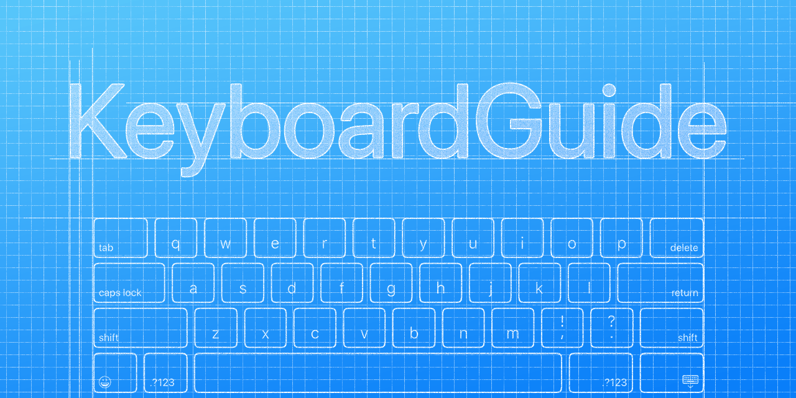

# KeyboardGuide

A modern, real iOS keyboard system notifications handler framework that Just Works.



As you know, handling the keyboard on iOS was just a nightmare.

On the internet, there are many, many iOS keyboard handler implementations for system notifications such as `UIResponder.keyboardWillChangeFrameNotification` (`UIKeyboardWillChangeFrameNotification`), but most of them are not implemented properly.

For example, many of them are not converting the keyboard frame in the right coordinate or not considering iPad keyboard behaviors.
Also, there are many undocumented behaviors that are not consistent between each iOS version.

This framework is solving this problem.

Based on years experience of iOS application development and various tests on each iOS version and device, it supports both Swift and Objective-C and works mostly reasonably on the latest 3 versions of iOS, which is iOS 11, 12 and iOS 13 now, and covers almost all iOS users.

## Usage

Using `KeyboardGuide` is really simple. See also [Examples](Examples/) for actual usage, that contains Swift and Objective-C code for testing.

### Add KeyboardGuide framework to your project

Add the following lines to your `Package.swift` or use Xcode “Add Package Dependency…” menu.

```swift
// In your `Package.swift`

dependencies: [
    // ...
    .package(url: "https://github.com/niw/KeyboardGuide.git"),
    // ...
]
```

### Using KeyboardGuide with the other dependency management tools.

`KeyboardGuide` doesn’t support directly the other dependency management tools than Swift Package Manager and CocoaPods.
It is highly recommend to use Swift Package Manager, if possible.
However, since it has no dependencies other than system frameworks, you can still use it from the other dependency management tools.

#### CocoaPods

To use `KeyboardGuide` from [CocoaPods](https://cocoapods.org/), add following line in your `Podfile`.

```ruby
pod 'KeyboardGuide'
```

#### Carthage

To use `KeyboardGuide` from [Carthage](https://github.com/Carthage/Carthage), update `Cartfile` in your project.

```
github "niw/KeyboardGuide"
```

Then, run following commands. This will create `Carthage/Build/iOS/KeyboardGuide.framework`.

```
$ carthage update
$ (cd Carthage/Checkouts/KeyboardGuide && swift package generate-xcodeproj)
$ carthage build --platform iOS
```

Follow [the instruction](https://github.com/Carthage/Carthage#if-youre-building-for-ios-tvos-or-watchos) to add the framework and Run Script phase to your project.

### Setup KeyboardGuide

Add `import KeyboardGuide`.

Use `KeyboardGuide.shared.activate()` to activate KeyboardGuide at the beginning of application life cycle, such as `application(_:didFinishLaunchingWithOptions:)`.

```swift
// In your `UIApplicationDelegate`

func application(_ application: UIApplication, didFinishLaunchingWithOptions launchOptions: [UIApplication.LaunchOptionsKey: Any]?) -> Bool {
    KeyboardGuide.shared.activate()
    // ...
}
```

### Add constraints on your views

Lay out your views by adding constraints to `view.keyboardSafeArea.layoutGuide`, where represents the safe area from, not covered by the keyboard.

It works as like `safeAreaLayoutGuide` for the notch.

```swift
// In your `UIViewController`

override func viewDidLoad() {
    super.viewDidLoad()
    // ...
    let textView = UITextView()
    textView.translatesAutoresizingMaskIntoConstraints = false
    // ...
    textView.bottomAnchor.constraint(equalTo: view.keyboardSafeArea.layoutGuide.bottomAnchor).isActive = true
    // ...
}
```

### Manual layout

If you prefer to manually lay out your views or need to use length of keyboard safe area, for such as updating `UIScrollView`’s `contentInset`, override `viewDidLayoutSubviews()` or `layoutSubviews()` as like regular manual lay outing.

```swift
// In your `UIViewController`

override func viewDidLayoutSubviews() {
    super.viewDidLayoutSubviews()
    // ...
    let bottomInset = view.keyboardSafeArea.insets.bottom
    textView.contentInset.bottom = bottomInset
    textView.scrollIndicatorInsets.bottom = bottomInset
}
```

#### The important layout behavior

If your `view` doesn’t have any sub views that have at least one constraint to `view.keyboardSafeArea.layoutGuide`, UIKit _MAY NOT_ call `layoutSubviews` (or similar callbacks such as `viewDidLayoutSubviews`).

Because in general, the keyboard safe area has a relative layout relationship between the keyboard position where is outside of the `view` but in the screen, UIKit doesn’t know that relationship without a constraint.

For example, on iOS 13, if a view controller is presented as a modal on iPad in portrait, when the keyboard is appearing, that modal view controller is moved upwards by UIKit.
This move changes the relative position of your `view` to the keyboard, however, UIKit doesn’t call your `layoutSubviews` (which is obvious,) but for keyboard safe area, you _MAY_ need to re lay out your sub views.

Therefore, you _MAY_ need to add at least one constraint to `view.keyboardSafeArea.layoutGuide` from one of your sub views, to let UIKit knows `view` has that relationship.

## Known limitations

There are a few known limitations in the current implementation.
All limitations are currently To-Do of this project.

- No SwiftUI support yet.

- Share extension can’t use this library yet because of `UIApplication` dependency.
